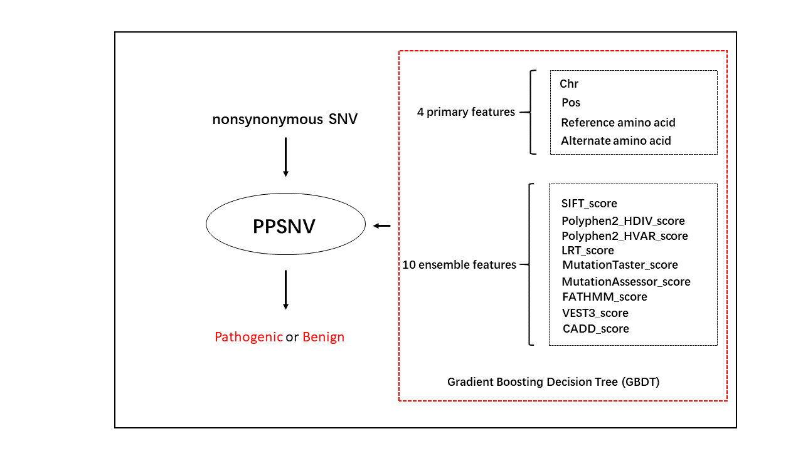
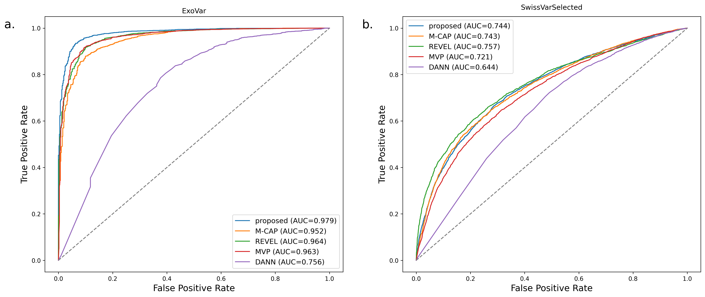

# PPSNV

PPSNV: A novel predictor for pathogenicity of nonsynonymous SNV based on ensemble learning

## Overview

PPSNV is a pathogenicity predictor for nonsynonymous single nucleotide variant (SNV) based on ensemble learning. It utilized 14 features of SNV in total including 10 pathogenicity score of existing predictors, which serve as input of a Gradient Boosting Decision Tree (GBDT) classifier. We tested it with two indepentdent test datasets and the results showed satisfying performance of PPSNV.

## The framework of PPSNV

## The details of features

title|title|title
-----|-----|-----
Feature|Description|Type
Chr|Chromosome|categorical
Pos|Position|numeric
Reference amino acid|-|categorical
Alternate amino acid|-|categorical
SIFT_score|amino acid substitution score of SIFT|numeric
LRT_score|likelihood ratio test score of mutation by LRT|numeric
FATHMM_score|functional effect score of missense variants by FATHMM|numeric
Polyphen2_HDIV_score|significance score of HumDiv-trained Polyphen2|numeric
Polyphen2_HVAR_score|significance score of HumVar-trained Polyphen2|numeric
MutationTaster_score|score of MutationTaster from dbNSFP[16]|numeric
MutationAssessor_score|functional impact combined score of MutationAssessor|numeric
RadialSVM_score|score of dbNSFP radial support vector machine score (RadialSVM)|numeric
CADD_score|scaled C-score of CADD|numeric
VEST3_score|pathogenicity score of VEST3|numeric

## The performance of SNV

## Requirements

- Python 3.7.9
    - lightgbn 3.2.1
    - scikit-learn 0.23.2
